# Travel Agency project

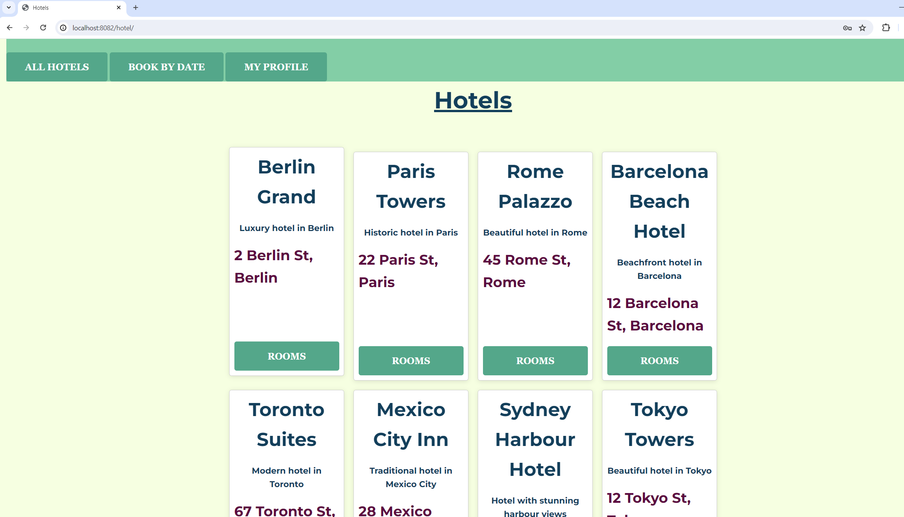<br>
<br>

## Project Overview

This project is a web application for a travel agency, allowing users to find and book hotels in various countries.
It has a separate managerial role that can add hotels and rooms to the system and view all users and their orders.
The application is built using Maven, Hibernate, Spring MVC (Thymeleaf or JSP + JSTL), and Spring Security.

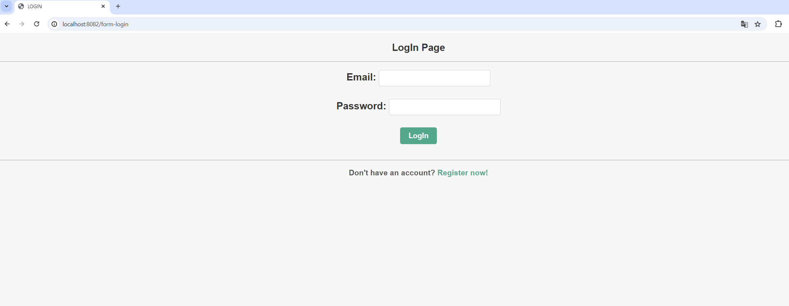<br>
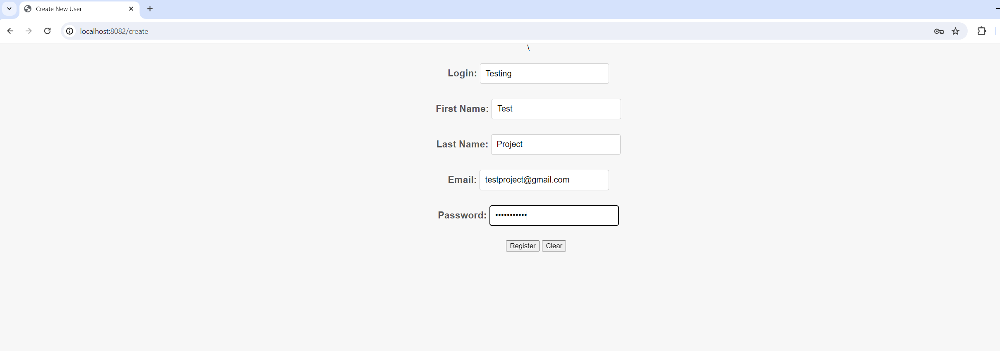<br>
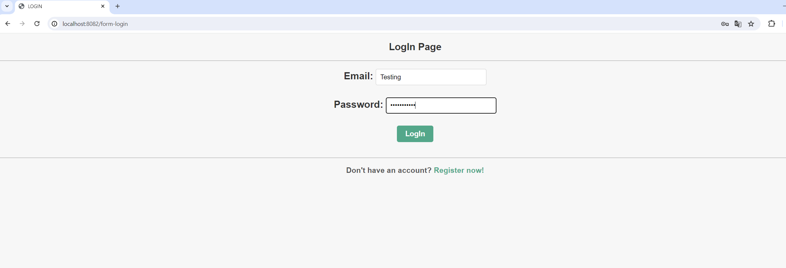<br>
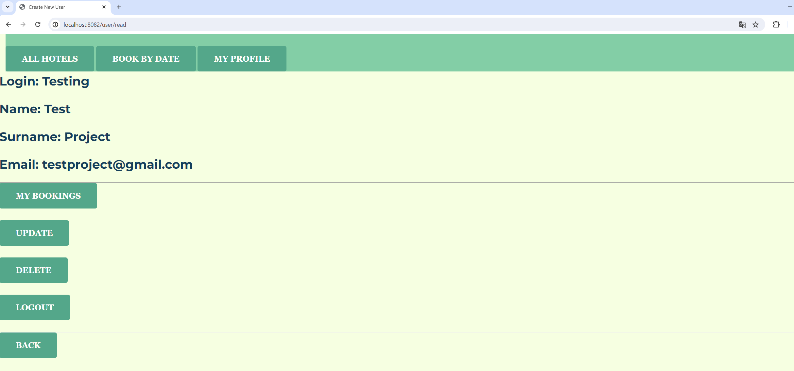<br>
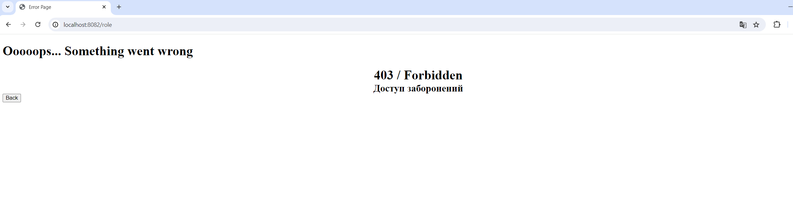<br>

## If you log in as an administrator, you can

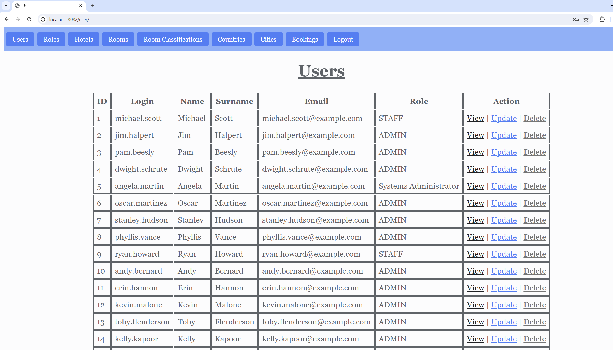<br>
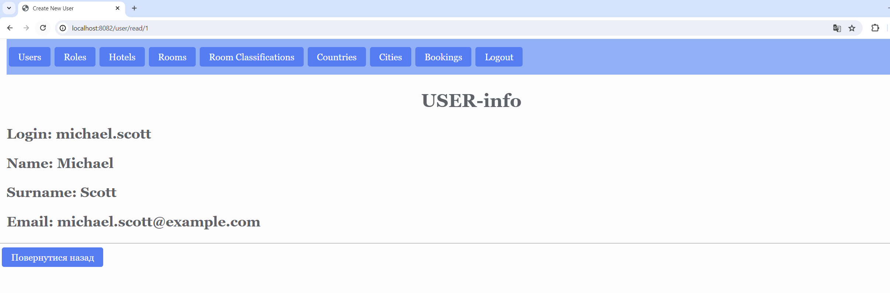<br>
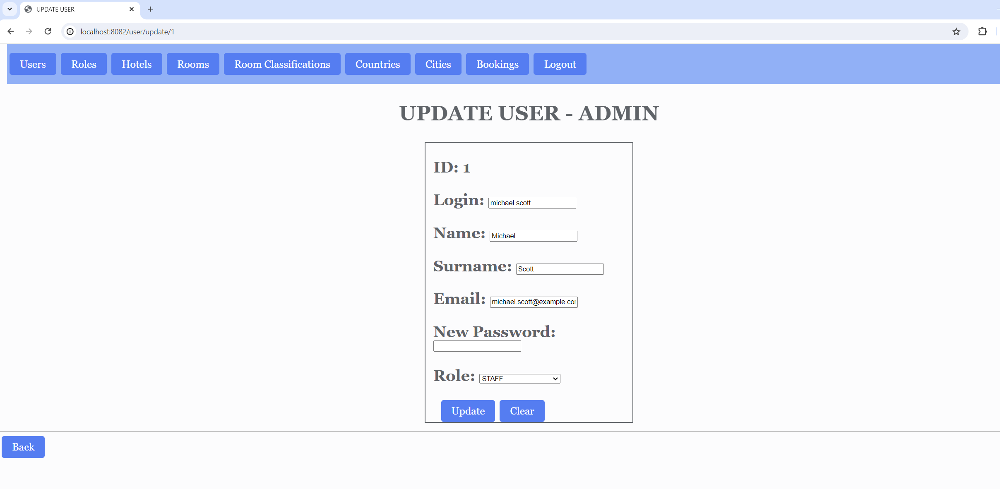<br>
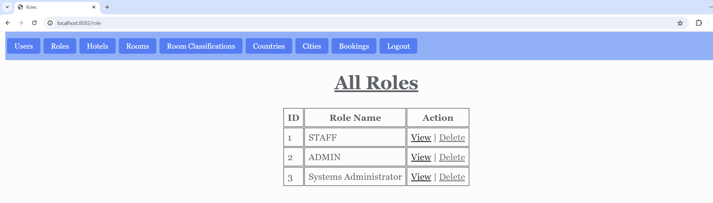<br>
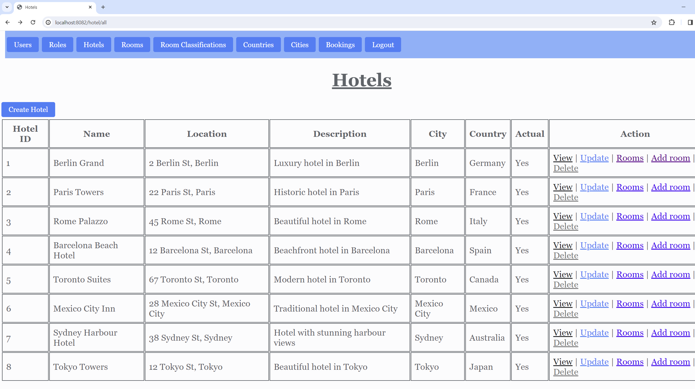<br>
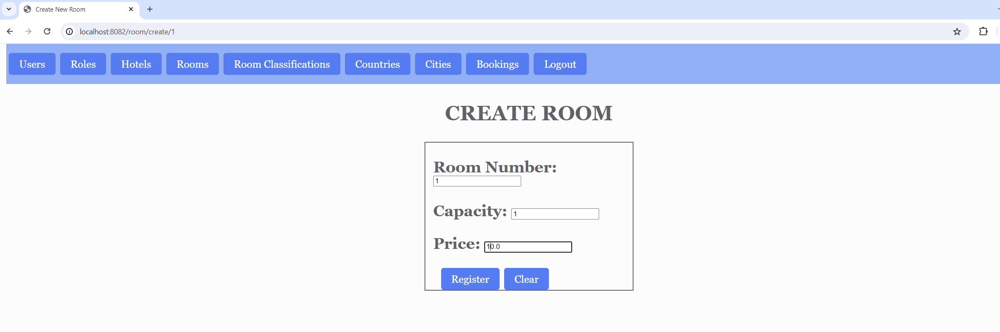<br>
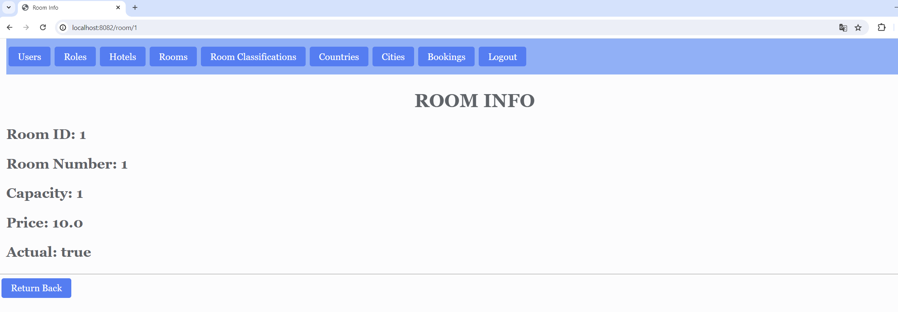<br>
<br>

## Technologies

- Java
- Maven
- Hibernate
- Spring MVC
- Thymeleaf
- Spring Security
- IntelliJ (IDE)
- MySQL

### Technical Details

- **Programming Language back-end:** Java
- **Database:** MySql
- **Required Tools:** Java 16, Maven 3.6.3

### Running the Project

1. **Build the Project:**
   Execute the following command in the `TravelAgency` directory:
```bash
mvn clean package
```

2. **Run the Project:**

After successful building, move the .war file in the Apache TomCat:

```text
   The application will start on 8080 port.
```

* **Database Configuration**

In the application's configuration file (application.properties), the path and connection data to the database are obtained from the following environment variables:

    DB_TRAVELAGENCY_URL
    DB_TRAVELAGENCY_USER
    DB_TRAVELAGENCY_PASSWORD

Before running, ensure that the MySql database contains a database, for example travelagency.

Wishing you success with the "Travel Agency" project!

---
